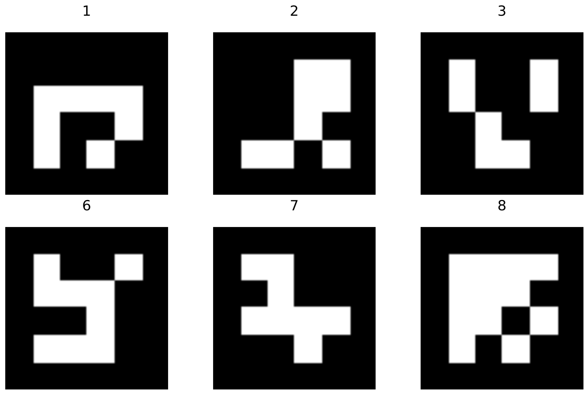

# Mondrian

Last Updated: 10 November 2019

A robot to draw on a flat surface, with local positioning done through a moving phone camera

# Next Steps

* Add a movement system:
	* 'Look at me' - the robot turns on its axis to face the camera
	* 'Follow me' - the robot continuously moves towards the camera
	* 'Trace a shape' - Find a way to upload a vector line file which the robot is able to follow and trace out
* Add a second view to the app, which shows the world from a top-down perspective. This makes it easier to draw, with your finger, the path you want the robot to take. Maybe the original 'camera' view is shown as a little floating window in the corner, like google maps?
* Add a sleep timer, that will HALT the robot after a certain amount of inactivity
* Add instructions for how to connect to the robot
* Add in a dedicated isolation switch that will disconnect the EN1 and EN2 pins on the H-bridge when the ESP is starting up. (Right now this is just done via a wire that is manually moved)


# Components

## 1. The Robot

* This project will control a simple 2 wheel drive robot. 
* On board the robot, there is:
	* an Arduino nano for basic motor control logic, 
	* 2 simple DC motors for movement
	* an ESP8266-01 WiFi chip to allow the robot to communicate with an android app
	* Aruco fiducial markers used for easy computer vision.
* The robot has no means of determining it's location onboard, and relies entirely on the android app.
* The ESP8266-01 starts an access point and basic HTTP server when it's powered up to which the android app connects.

### Breadboard


### Circuit Diagram


### Example Aruco Markers




## 2. The Phone Camera

* An Android app uses the phone's rear camera to calculate the relative position and rotation of Aruco fiducial markers placed on the robot.
* The app can connect the phone to the robot's access point, and then communicate with the robot via a basic HTTP server setup by the robot.
* The app user can send control commands to the robot, as well as more sophisticated commands that require the information gained by the external camera viewpoint.
* With the addition of a reference Aruco marker placed on the ground, the robot could:
	* move towards the other Aruco marker on the floor
	* continuously move away from the camera / maintain a certain distance from the camera
	* trace a consistent square on the ground while the camera viewpoint changes
	* if multiple phones were used, the robot could expand its area of reliable movement to beyond that of just one camera's viewpoint by selecting the closest or most accurate viewpoint

### Images

 

# Current progress

### Marker pose estimation and surface projection

A prototype of the marker detection, pose estimation and projection onto a 2D plane has been developed.
The picture below show an image taken with a phone camera where the aruco markers have been detected. The second picture shows a projection of the marker positions and a "normal" for each marker (point showing the orientation of the marker).


### Network protocols

Prototype protocols and implementations for wireless remote debugging and receiving location updates on the ESP have been developed.

# File Structure
```
Mondrian  
├── Arduino\ and\ ESP  
│   ├── esp  
│   │   └── esp.ino  
│   ├── james.fzz  
│   ├── james.ino  
│   │   ├── james  
│   │   │   └── james.ino  
│   │   └── james.ino.ino  
│   ├── james_bb.png  
│   ├── nano  
│   │   └── nano.ino  
│   └── uno  
│       └── uno.ino  
├── Phone\ Camera  
│   ├── Aruco\ Markers.pdf  
│   └── OpenCVDeus  
│       ├── `// In here is the Android Studio Project`  
└── README.md  
```


# Uploading Code to the ESP8266

Unfortunately, the ESP8266-01 can be very finicky, but below is the best way I've found to flash it and upload code.

* Write code for the ESP8266
* Change board to 'Generic ESP8266 Module'
* Compile the code
* Connect the UNO to the computer
* Connect the UNO to the ESP8266: 
    * UNO Tx --> ESP Tx
    * UNO Rx --> ESP Rx
* Click 'Upload' on the Arduino IDE
* Then do this sequence to the following pins
    * ESP RESET --> LOW
    * ESP GPIO0 --> LOW
    * ESP RESET --> XXX
    * ESP GPIO0 --> XXX
* You might have to try this compile-button sequence a few times
before you see something like this:
```Connecting........_____....._____....._____.
Chip is ESP8266EX
Features: WiFi
...
```
* After this, push and release the RESET button, and all should 
be good
* Possible Errors: 
    * TODO: Add errors

* For the NANO, upload nano.ino, but make sure 
'ATMega 382P (Old Bootloader)' is selected


